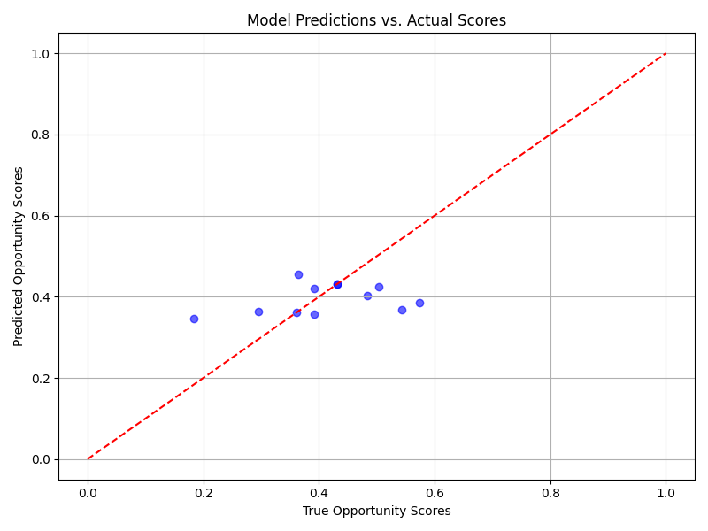

# AI for Scientific Articles Analysis

A comprehensive tool for analyzing scientific research opportunities in medical literature using artificial intelligence.



## Overview

This application helps researchers identify promising research opportunities by:
1. Finding relevant scientific articles from PubMed
2. Analyzing citation patterns, novelty, and research trends
3. Computing opportunity scores to guide research decisions
4. Storing and managing a database of research interests and findings

## Features

- **PubMed Integration:** Search PubMed with advanced query options
- **Keyword Generation:** AI-powered extraction of relevant keywords from research ideas
- **MeSH Term Expansion:** Automatically expands search terms using MeSH vocabulary
- **Opportunity Scoring:** Calculates research opportunity scores based on:
  - **Novelty:** How unique the research area is
  - **Citation Rate:** Impact and attention in the scientific community
  - **Recency:** Timeliness and current relevance of the topic
- **Data Storage:** PostgreSQL database for storing articles and analysis results
- **Data Export:** Export results to CSV for further analysis
- **Machine Learning Model:** Trained model to predict opportunity scores

## Setup Instructions

```
git clone https://github.com/rosmae/AI-for-Scientific-Articles-Analysis.git
cd AI-for-Scientific-Articles-Analysis
python3 -m venv venv
source venv/bin/activate  # For Windows: venv\Scripts\activate
pip install -r requirements.txt
python main.py
```
